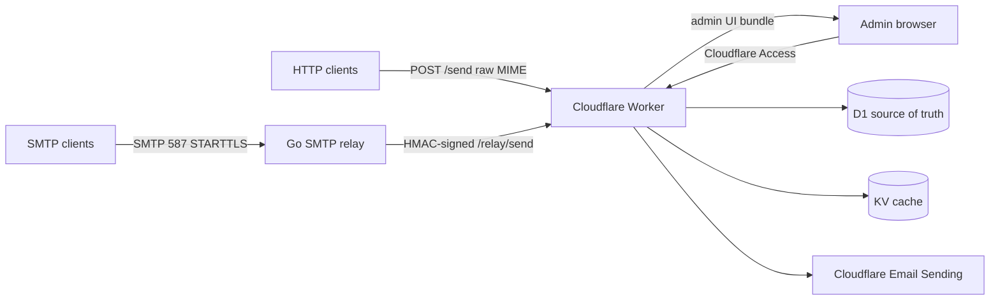

# Cloudflare Mail Relay

SMTP submission relay for custom-domain sending through Cloudflare Email
Sending. Use it with Gmail's **Send mail as**, internal applications, scripts,
or any SMTP-capable client that needs authenticated outbound mail.

The project has two deployable pieces:

- A Cloudflare Worker that enforces policy, calls Email Sending `send_raw`, and
  serves the admin UI bundle at the same hostname (Workers Static Assets).
  Protected by Cloudflare Access.
- A Go SMTP relay you run on a public Docker host.

Most of the stack runs on Cloudflare. The SMTP relay is the exception: SMTP
clients need a public raw TCP listener on port `587`, which Cloudflare
Workers/Containers do not currently provide. Run the relay anywhere you
already operate Docker, or on a small public VM such as a GCP free-tier
eligible `e2-micro` instance in one of Google's supported free-tier regions.



## What It Does

- SMTP submission on port `587` for mail clients and applications.
- Raw MIME HTTP API for applications.
- Admin UI for domains, senders, users, SMTP credentials, API keys, and events.
- Multi-domain sending from one Cloudflare account.
- Metadata-only audit log, idempotency, quotas, and basic operational doctors.

## What It Does Not Do

- No inbound email handling.
- No templates, mailing lists, scheduling, or message body storage.
- No built-in password login for the admin UI; Cloudflare Access is the auth
  boundary.
- No structured JSON email composer. The HTTP API accepts raw MIME only.

## Requirements

- Cloudflare account with Workers Paid.
- A Cloudflare-managed zone for the admin host (e.g. `mail.example.com` on a
  zone you own). Does not have to be the same as your sending domain — many
  adopters use a dedicated zone like `mail.<their-domain>` purely for the
  relay's control plane.
- Each sending domain must use Cloudflare DNS and have Cloudflare Email Sending
  enabled and verified.
- A Docker host reachable on TCP `587` for the SMTP relay. This can be existing
  infrastructure or a small VM such as a GCP free-tier eligible `e2-micro`
  instance. Check the provider's current free-tier region and egress limits.
- Local `pnpm`, `wrangler`, and `docker`.

## Setup

Install dependencies:

```sh
pnpm install
wrangler login
```

Run the setup preflight. Repeat `--domain` for every sending domain:

```sh
pnpm run setup --account-id <cloudflare-account-id> --domain example.com --dry-run
```

Use `pnpm run setup`, not bare `pnpm setup`; pnpm reserves the bare command for
its own shell setup helper.

Create and bind the Cloudflare resources:

```sh
pnpm --dir worker exec wrangler d1 create cf-mail-relay
pnpm --dir worker exec wrangler kv namespace create cf-mail-relay-hot
cp worker/wrangler.toml.example worker/wrangler.toml
```

Paste the D1/KV IDs into `worker/wrangler.toml`, then apply migrations and set
secrets:

```sh
pnpm --dir worker exec wrangler d1 migrations apply cf-mail-relay --remote
pnpm --dir worker exec wrangler secret put CF_API_TOKEN
pnpm --dir worker exec wrangler secret put CREDENTIAL_PEPPER
pnpm --dir worker exec wrangler secret put METADATA_PEPPER
pnpm --dir worker exec wrangler secret put RELAY_HMAC_SECRET_CURRENT
pnpm --dir worker exec wrangler secret put BOOTSTRAP_SETUP_TOKEN
```

Apply D1 migrations, including `0002_security_hardening.sql`, before deploying
a newer Worker. `/healthz` checks the schema version and returns
`schema_version_mismatch` until the database is at the version expected by the
code.

Edit `worker/wrangler.toml` so the `routes` block points at your admin
hostname (e.g. `mail.example.com` on a Cloudflare-managed zone), then create
the Cloudflare Access app for that hostname:

```sh
pnpm access:setup \
  --account-id <cloudflare-account-id> \
  --allow-email <admin@example.com> \
  --pages-url https://mail.example.com \
  --apply-config worker/wrangler.toml
```

Build the UI into the Worker's asset directory, then deploy the Worker:

```sh
pnpm --filter @cf-mail-relay/ui build      # outputs to worker/public/
pnpm --dir worker exec wrangler deploy
```

The Worker serves the admin UI from the same hostname as the API; no
separate Pages project is involved.

Bootstrap the first admin user with `POST /bootstrap/admin`, then rotate or
remove `BOOTSTRAP_SETUP_TOKEN`.

## DNS

For each sending domain, publish the records Cloudflare Email Sending gives you:

- `cf-bounce.<domain>` MX.
- `cf-bounce.<domain>` SPF TXT.
- DKIM TXT/CNAME.
- `_dmarc.<domain>` TXT. Start with `v=DMARC1; p=none`.

Create one DNS-only SMTP relay record:

```text
smtp.example.com. A <relay-host-ip>
```

Do not orange-cloud the SMTP hostname. Cloudflare's HTTP proxy does not proxy
SMTP.

Email Sending records are for outbound mail and usually live under
`cf-bounce.<domain>`. Cloudflare Email Routing records are for inbound mail and
live at the apex. Keep those concepts separate.

## Relay

Run the relay on the Docker host:

```sh
docker compose -f infra/docker/relay.compose.yml up -d
```

The relay needs these environment values:

| Variable | Purpose |
|---|---|
| `RELAY_WORKER_URL` | Worker base URL |
| `RELAY_KEY_ID` | HMAC key id sent to Worker |
| `RELAY_HMAC_SECRET` | Shared HMAC secret matching Worker secret |
| `RELAY_TLS_CERT_FILE` | Mounted certificate path |
| `RELAY_TLS_KEY_FILE` | Mounted private key path |

See `infra/docker/` for plain Docker, lego, Traefik, and host-certbot examples.

## SMTP Clients

For each sender address:

1. Add or verify the domain in the admin UI.
2. Add the exact sender address.
3. Create an SMTP credential scoped to that sender.
4. Configure your SMTP client with the relay hostname, port `587`, STARTTLS, the
   SMTP username, and the generated SMTP password.

For Gmail, open Settings -> Accounts and Import -> Send mail as -> Add another
email address. Use the relay hostname, port `587`, TLS, the SMTP username, and
the generated SMTP password, then confirm Gmail's verification email.

For applications, use the same values:

| SMTP setting | Value |
|---|---|
| Host | `smtp.<domain>` or your chosen relay hostname |
| Port | `587` |
| Security | STARTTLS |
| Username | SMTP credential username |
| Password | SMTP credential password |

Multiple sender domains can use the same relay hostname. For example,
`alex@example.com` and `ops@example.org` can both use `smtp.example.com:587`.

## HTTP Send API

Applications can send raw MIME directly through the Worker:

```sh
curl -fsS https://<worker-host>/send \
  -H "Authorization: Bearer <api-key>" \
  -H "Content-Type: application/json" \
  -H "Idempotency-Key: <stable-key>" \
  --data '{"from":"alex@example.com","recipients":["to@example.net"],"raw":"<base64url-mime>"}'
```

The API key must belong to a user allowed to send as the `from` address.
The MIME `From:` header must also match `from`; `Bcc:` is stripped before
delivery. Duplicate `From:`, `Sender:`, or `Message-ID:` headers are rejected.

Breaking change: `/send` clients must pass `from` and `recipients` explicitly in
the JSON body. The Worker no longer derives the delivery envelope from `To:`,
`Cc:`, or `Bcc:` MIME headers.

## Verification and Operations

Run local checks:

```sh
pnpm doctor:local -- --domain example.com --worker-url https://<worker-host>
pnpm doctor:delivery -- --domain example.com
```

`doctor:local` checks DNS, Worker health, SMTP STARTTLS, and optional SMTP AUTH.
`doctor:delivery` gives you a subject token, then asks you to paste received
headers so it can confirm DKIM and DMARC pass.

Operational notes:

- Rotate `RELAY_HMAC_SECRET` by setting `RELAY_HMAC_SECRET_PREVIOUS`, deploying a
  new current secret, updating relay hosts, then removing previous after the
  overlap window.
- Rotate leaked SMTP credentials or API keys from the admin UI.
- D1 is the source of truth. KV is cache only.
- D1 Time Travel can restore production databases, but restore is destructive.
- The Worker includes a daily Cron cleanup for expired replay and idempotency
  rows. Keep the `[triggers]` section from `worker/wrangler.toml.example`.
- Provider delivery arrays in `send_events` are stored as privacy-preserving
  summaries with counts and categorical reason/status codes only.
- Keep attachments under about 3.25 MiB before encoding; MIME/base64 overhead can
  push larger files over Cloudflare's 5 MiB Email Sending limit.

## Development

```sh
pnpm test
pnpm typecheck
pnpm build
go test ./...          # from relay/
```

Architecture and contributor notes live in [docs/architecture.md](./docs/architecture.md).

## License

Apache-2.0. See [LICENSE](./LICENSE).
