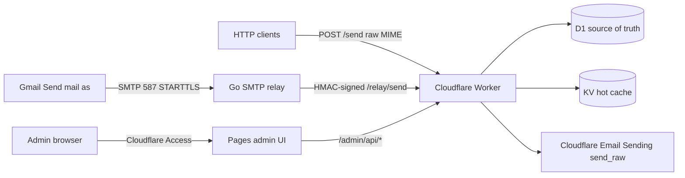

# Cloudflare Mail Relay

Self-hosted SMTP-to-Cloudflare-Email-Sending bridge for Gmail "Send mail as"
and raw-MIME HTTP sends.

## Architecture



## Components

1. **Docker SMTP relay**: accepts authenticated SMTP submission on `587`
   with STARTTLS and forwards raw RFC 5322 MIME to the Worker.
2. **Cloudflare Worker**: verifies credentials, sender policy, idempotency,
   rate limits, and calls Cloudflare Email Sending `send_raw`.
3. **Cloudflare Pages admin UI**: static admin surface protected by
   Cloudflare Access.

## Status

Functional MVP milestones MS0 through MS6 are implemented:

- Gmail-originated MIME was proven against Cloudflare Email Sending with
  DKIM/DMARC pass.
- Gmail SMTP relay path works.
- D1/KV-backed state, audit log, idempotency, admin UI, HTTP `/send`, rate
  limits, doctor scripts, and distribution setup are in place.
- Remaining work after v0.1 is normal hardening from real adopter feedback.

## Prerequisites

- Cloudflare account on **Workers Paid**.
- Sending domain DNS on Cloudflare.
- Cloudflare Email Sending enabled and verified for each sending domain.
- Docker-capable host with inbound TCP `587`.
- Local `pnpm`, `wrangler`, `docker`, and `gh` for setup/release workflows.

## Quickstart

```sh
pnpm install

# Plan and preflight setup. Repeat --domain for each sending domain.
pnpm run setup --account-id <cloudflare-account-id> --domain example.com --dry-run

# After creating/binding D1, KV, Access, secrets, and DNS:
pnpm --dir worker exec wrangler d1 migrations apply cf-mail-relay --remote
pnpm --dir worker exec wrangler deploy
PUBLIC_CF_MAIL_RELAY_API_BASE=https://<worker-host> pnpm --filter @cf-mail-relay/ui build
pnpm --dir worker exec wrangler pages deploy ../ui/dist --project-name cf-mail-relay-ui --branch main

# Relay host:
docker compose -f infra/docker/relay.compose.yml up -d

# Verification:
pnpm doctor:local -- --domain example.com --worker-url https://<worker-host>
pnpm doctor:delivery -- --domain example.com
```

For a full walkthrough, see [docs/getting-started.md](./docs/getting-started.md).

## Repository Layout

```
relay/    Go SMTP daemon, multi-arch Docker image
worker/   Cloudflare Worker (TypeScript, Hono)
ui/       Cloudflare Pages admin app (Astro)
shared/   TypeScript types, zod schemas, HMAC test vectors
infra/    Setup wizard, Docker compose examples, doctor scripts
docs/     Architecture, deployment, security, threat model
examples/ Sample HTTP clients and Gmail MIME fixtures
ADR/      Architecture decision records
```

## Design Boundaries

- Send-only. No inbound mail handling.
- Raw MIME only. No templates, mailing lists, or message-body storage.
- One Worker supports many domains in one Cloudflare account.
- Cloudflare Access is the admin auth boundary.

## License

Apache-2.0. See [LICENSE](./LICENSE).
