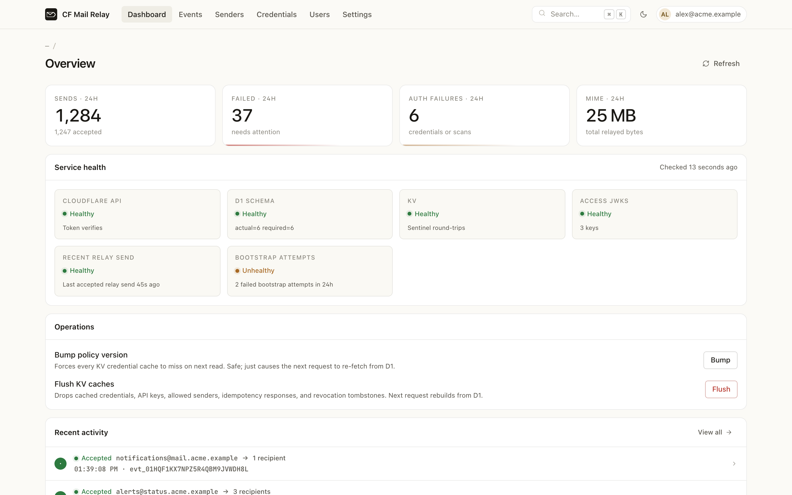
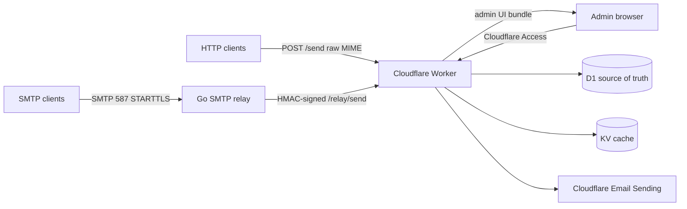

# Cloudflare Mail Relay

SMTP submission relay for custom-domain sending through Cloudflare Email
Sending. Use it with Gmail's **Send mail as**, internal applications, scripts,
or any SMTP-capable client that needs authenticated outbound mail.



[Live demo: explore the admin UI with sample data](https://relay-demo.alexmiller.net)

The demo is deployed separately from the production Worker. It uses the real UI
with an in-browser mock API, so you can click through domains, senders, users,
credentials, API keys, and events without sending mail or changing Cloudflare
resources.

The project has two deployable pieces:

- A Cloudflare Worker that enforces policy, calls Email Sending `send_raw`, and
  serves the admin UI bundle at the same hostname (Workers Static Assets). The
  static shell is public; admin and self-service data APIs are protected by
  Cloudflare Access.
- A Go SMTP relay you run on a Docker host reachable from your SMTP clients.

The public demo is a third, optional static Worker. It has no D1, KV, Access,
Email Sending token, HMAC secret, or send endpoints.

Most of the stack runs on Cloudflare. The SMTP relay is the exception: SMTP
clients need a raw TCP listener on port `587`, which Cloudflare
Workers/Containers do not currently provide. That listener only needs to be
reachable from your SMTP clients; it can be public for Gmail-style send-as
workflows or private for internal applications. Run the relay anywhere you
already operate Docker, or on a small VM such as a GCP free-tier eligible
`e2-micro` instance in one of Google's supported free-tier regions.


```mermaid
flowchart LR
  SMTP[SMTP clients] -->|SMTP 587 STARTTLS| Relay[Go SMTP relay]
  Apps[HTTP clients] -->|POST /send raw MIME| Worker[Cloudflare Worker]
  Relay -->|HMAC-signed /relay/send| Worker
  Admin[Admin browser] -->|Cloudflare Access| Worker
  Worker -->|admin UI bundle| Admin
  Worker --> D1[(D1 source of truth)]
  Worker --> KV[(KV cache)]
  Worker --> Email[Cloudflare Email Sending]
```

## What It Does

- SMTP submission on port `587` for mail clients and applications.
- Conversation-thread compatibility for SMTP clients when Cloudflare replaces
  their submitted `Message-ID` values.
- Raw MIME HTTP API for applications.
- Admin UI for domains, senders, users, SMTP credentials, API keys, and events.
- Multi-domain sending from one Cloudflare account.
- Metadata-only audit log, idempotency, quotas, and basic operational doctors.

## Demo

Try the admin UI without connecting it to Cloudflare:

```text
https://relay-demo.alexmiller.net
```

The demo is a separate static Worker, not a route on a production relay
deployment. It uses the real UI with an in-browser mock API and sample data.
Actions such as creating credentials, refreshing domains, rolling API keys, and
opening event drawers are simulated locally; no email is sent and no
Cloudflare resources are changed.

## What It Does Not Do

- No inbound email handling.
- No templates, mailing lists, scheduling, or message body storage.
- No built-in password login for the admin UI; Cloudflare Access is the auth
  boundary.
- No structured JSON email composer. The HTTP API accepts raw MIME only.

## Requirements

### Cloudflare account

Before running setup, enable each of these in your Cloudflare account. Most are
one-click toggles; do them up-front to avoid setup tripping on partial state.

- **Workers Paid subscription** ($5/month). Required for Email Sending.
- **Zero Trust enabled**. The admin UI uses Cloudflare Access, and new
  Cloudflare accounts may need to enable Zero Trust before Access apps can be
  created.
- **A Cloudflare-managed zone for the admin host** (e.g. `mail.example.com` on
  a zone you own). Does not have to be the same zone as your sending domain:
  `mail.example.com` and a sending domain `example.org` on a different zone is
  fine. Many adopters use a dedicated zone like `mail.<their-domain>` purely
  for the relay's control plane.
- **Each sending domain**:
  - Must use Cloudflare DNS.
  - Must have Cloudflare Email Sending enabled and verified in the Cloudflare
    dashboard before setup can complete. Setup verifies this; it does not
    enable it for you.
  - Can usually keep existing apex MX records for inbound mail. Email Sending
    publishes outbound bounce/auth records under `cf-bounce.<domain>` and does
    not normally require moving inbound mail. If the Cloudflare onboarding UI
    reports a DNS conflict, follow that specific error before rerunning setup.

You can find your Cloudflare account ID in the dashboard URL
(`https://dash.cloudflare.com/<account-id>`) or by running `wrangler whoami`
once you have set a token.

### Local environment

- Local Node.js 22, `pnpm`, `wrangler`, and `docker`.
- A Docker host reachable on TCP `587` from the clients or services that will
  submit mail. It only needs to be public if public clients such as Gmail need
  to connect to it; for private applications, it can live behind your firewall
  or on an internal network. This can be existing infrastructure or a small VM
  such as a GCP free-tier eligible `e2-micro` instance. Check the provider's
  current free-tier region and egress limits.

## Setup

Install dependencies:

```sh
pnpm install
```

Create a Cloudflare API token and export it before running live preflight or
apply:

```sh
export CLOUDFLARE_API_TOKEN=...
pnpm exec wrangler whoami
```

You do not need `wrangler login`; the setup flow uses the API token.

### Cloudflare API token permissions

Cloudflare calls write permissions "Edit" in the token UI. Older docs or error
messages may say "Write"; choose "Edit" in the dashboard. The setup token
should have:

- Account -> Account Settings -> Read
- Account -> Billing -> Read
- Account -> D1 -> Edit
- Account -> Email Sending -> Edit
- Account -> Workers KV Storage -> Edit
- Account -> Workers Routes -> Read
- Account -> Workers Routes -> Edit
- Account -> Workers Scripts -> Edit
- Account -> Workers Tail -> Read
- Account -> Access: Organizations -> Read
- Account -> Access: Apps -> Edit
- Account -> Access: Policies -> Edit
- User -> User Details -> Read
- Zone -> Zone -> Read
- Zone -> DNS -> Edit
- Zone -> Zone DNS Settings -> Edit

Apply the zone permissions to the zone(s) hosting your admin URL and sending
domains.

### Preflight and apply

Run a preflight check. Setup validates the token, account, and zone, then
prints a plan without mutating Cloudflare. If `CLOUDFLARE_API_TOKEN` is not set,
it falls back to plan-only output. Repeat `--domain` for every sending domain:

```sh
pnpm run setup \
  --account-id <cloudflare-account-id> \
  --admin-url https://mail.example.com \
  --allow-email <admin@example.com> \
  --domain example.com
```

Use `pnpm run setup`, not bare `pnpm setup`; pnpm reserves the bare command for
its own shell setup helper.

If setup fails on a fresh Cloudflare account:

- Access organization or `access_not_enabled` errors usually mean Zero Trust
  has not been enabled yet.
- Workers Paid warnings usually mean the account has not subscribed to Workers
  Paid. Email Sending requires this.
- Email Sending failures usually mean the domain has not been onboarded under
  Cloudflare Email Sending yet.
- `401` or `403` from deploy or route steps usually means the setup token is
  missing one of the Workers Scripts, Workers Routes, Zone, or DNS permissions.

Create the Cloudflare resources, apply migrations, deploy the Worker, bootstrap
the first admin, and write `RUNBOOK.md`:

```sh
pnpm run setup --apply \
  --account-id <cloudflare-account-id> \
  --admin-url https://mail.example.com \
  --allow-email <admin@example.com> \
  --domain example.com \
  --smtp-host smtp.example.com
```

For each `--domain`, `--apply` looks up the Cloudflare zone and Email Sending
status before deploying, then registers the domain in D1 so it shows up on
first login. You should not need to copy zone IDs by hand or add the domain
again through the UI. `--smtp-host` is the SMTP relay hostname shown in
credential setup details; omit it to use `smtp.<first-domain>`. You can change
it later from **Settings**.

The wizard intentionally does **not** push its broad setup API token as the
Worker runtime `CF_API_TOKEN`. On a new installation, the first `--apply`
creates or reuses the infrastructure and pushes the three generated
application secrets, then stops before the build and final deploy step if
`CF_API_TOKEN` is absent. This intentional first phase exits nonzero so an
unattended setup cannot mistake the incomplete deployment for success; after
setting the runtime token, rerun the same command to finish.
Create a least-privilege Cloudflare API token with **Account -> Email Sending
-> Edit** plus **Zone -> Zone -> Read** for the sending zones, then push it:

```sh
pnpm --dir worker exec wrangler secret put CF_API_TOKEN
```

Keep the broad setup token exported so Wrangler can authenticate, and paste
the new least-privilege runtime token at the secret-value prompt.

Rerun the same `pnpm run setup --apply ...` command to verify the complete
secret set and finish deployment. For an intentionally one-shot installation,
`--push-cf-api-token` reuses the broad setup token and prints a warning; rotate
that token to a least-privilege runtime token immediately afterward.

Generated values are saved before the first remote mutation in
`.cf-mail-relay-setup-recovery.json`. This gitignored file is written with mode
`0600`, is bound to the selected account, Worker, and relay key ID, and lets an
interrupted setup resume with exactly the same values. Do not delete it while
recovering a failed setup. The wizard removes it after successfully writing
the gitignored `RUNBOOK.md`.

Wrangler secret writes may create and deploy intermediate Worker versions.
Setup sends all three generated application secrets in one bulk request to
avoid three successive partial versions, then reads the remote names again and
blocks the final application deploy until every required name, including
`CF_API_TOKEN`, is present. If the bulk result is ambiguous because the process
was interrupted, retrying resends the same journaled values.

Setup treats Worker secret names in Cloudflare as the source of truth; the
presence or absence of a local `worker/wrangler.toml` never triggers secret
generation. A fresh clone reuses a complete remote secret set. If an existing
Worker has only part of the managed secret set and there is no matching
recovery journal, setup refuses to guess or replace live values.

`--rotate-all-worker-secrets` is an explicit destructive disaster-recovery
operation. It replaces the credential pepper, metadata pepper, and relay HMAC
secret, invalidating existing credentials and requiring relay reconfiguration.
Do not use it for a normal retry or routine HMAC rotation; use `pnpm
rotate:hmac` for the latter. If destructive replacement is interrupted, rerun
with `--rotate-all-worker-secrets` again to confirm the destructive intent and
resume the same journaled values. Setup refuses both a replacement journal
without the flag and the flag alongside a normal-initialization journal.

Validate the same-origin Access gate:

```sh
pnpm access:verify --admin-url https://mail.example.com
```

The Worker serves the admin UI from the same hostname as the API; no separate
Pages project is involved. The Access app must be path-scoped to
`/admin/api/*` and `/self/api/*`. Do not put `/`, `/_astro/*`, `/relay/*`,
`/send`, `/bootstrap/admin`, or `/healthz` behind Access.
The UI's sign-in button navigates to `/self/api/login`, which is inside the
Access-gated self-service path and redirects back to the UI after Access auth.

Manual setup is still possible: copy `worker/wrangler.toml.example`, create D1
and KV, apply all migrations before deploying, set secrets with `wrangler secret
put`, build `ui/` into `worker/public/`, deploy the Worker, then either insert
the first admin row directly in D1 or use the recovery-only `POST
/bootstrap/admin` endpoint with a temporary `BOOTSTRAP_SETUP_TOKEN` secret.
Delete `BOOTSTRAP_SETUP_TOKEN` immediately after manual bootstrap.

## DNS

For each sending domain, publish the records Cloudflare Email Sending gives you:

- `cf-bounce.<domain>` MX.
- `cf-bounce.<domain>` SPF TXT.
- DKIM TXT/CNAME.
- `_dmarc.<domain>` TXT. Start with `v=DMARC1; p=none`.

Create one DNS-only SMTP relay record:

```text
smtp.example.com. A <relay-host-ip>
```

Do not orange-cloud the SMTP hostname. Cloudflare's HTTP proxy does not proxy
SMTP.

Email Sending records are for outbound mail and usually live under
`cf-bounce.<domain>`. Cloudflare Email Routing records are for inbound mail and
live at the apex. Keep those concepts separate.

## Relay

Run the relay on the Docker host:

```sh
docker compose -f infra/docker/relay.compose.yml up -d
```

The relay needs these environment values:

| Variable | Purpose |
|---|---|
| `RELAY_WORKER_URL` | Worker base URL |
| `RELAY_KEY_ID` | HMAC key id sent to Worker |
| `RELAY_HMAC_SECRET` | Shared HMAC secret matching Worker secret |
| `RELAY_TLS_CERT_FILE` | Mounted certificate path |
| `RELAY_TLS_KEY_FILE` | Mounted private key path |

See `infra/docker/` for the supported nonroot Compose deployment with
host-managed certificates and an atomic renewal helper.

## SMTP Clients

For each sender address:

1. Add or verify the domain in the admin UI.
2. Add the exact sender address.
3. Create an SMTP credential scoped to that sender.
4. Configure your SMTP client with the relay hostname, port `587`, STARTTLS, the
   SMTP username, and the generated SMTP password.

For Gmail, open Settings -> Accounts and Import -> Send mail as -> Add another
email address. Use the relay hostname, port `587`, TLS, the SMTP username, and
the generated SMTP password, then confirm Gmail's verification email. The relay
copies Gmail's original `Message-ID` into `References` before Cloudflare Email
Sending replaces it, allowing replies to reconnect to Gmail's local Sent
conversation.

For applications, use the same values:

| SMTP setting | Value |
|---|---|
| Host | `smtp.<domain>` or your chosen relay hostname |
| Port | `587` |
| Security | STARTTLS |
| Username | SMTP credential username |
| Password | SMTP credential password |

Multiple sender domains can use the same relay hostname. For example,
`alex@example.com` and `ops@example.org` can both use `smtp.example.com:587`.
The app stores this hostname in **Settings** so users see the host, port, and
STARTTLS requirement when they create or roll SMTP credentials.

## HTTP Send API

Applications can send raw MIME directly through the Worker:

```sh
curl -fsS https://<worker-host>/send \
  -H "Authorization: Bearer <api-key>" \
  -H "Content-Type: application/json" \
  -H "Idempotency-Key: <stable-key>" \
  --data '{"from":"alex@example.com","recipients":["to@example.net"],"raw":"<base64url-mime>"}'
```

The API key must belong to a user allowed to send as the `from` address.
The MIME `From:` header must also match `from`; `Bcc:` is stripped before
delivery. Duplicate `From:`, `Sender:`, or `Message-ID:` headers are rejected.

Breaking change: `/send` clients must pass `from` and `recipients` explicitly in
the JSON body. The Worker no longer derives the delivery envelope from `To:`,
`Cc:`, or `Bcc:` MIME headers.

## Verification and Operations

Run local checks:

```sh
pnpm doctor:local -- --domain example.com --worker-url https://<worker-host>
pnpm doctor:delivery -- --domain example.com
```

`doctor:local` checks DNS, Worker health, SMTP STARTTLS, and optional SMTP AUTH.
`doctor:delivery` gives you a subject token, then asks you to paste received
headers so it can confirm DKIM and DMARC pass.

Operational notes:

- Rotate `RELAY_HMAC_SECRET` by setting `RELAY_HMAC_SECRET_PREVIOUS`, deploying a
  new current secret, updating relay hosts, then removing previous after the
  overlap window.
- Rotate leaked SMTP credentials or API keys from the admin UI.
- D1 is the source of truth. KV is cache only.
- D1 Time Travel can restore production databases, but restore is destructive.
- The setup wizard bootstraps the first admin directly in D1 and does not create
  `BOOTSTRAP_SETUP_TOKEN`. If you use the manual `/bootstrap/admin` recovery
  flow, delete `BOOTSTRAP_SETUP_TOKEN` immediately after bootstrap.
- The Worker includes a daily Cron cleanup for expired replay, idempotency,
  auth-failure, and quota rows. Keep the `[triggers]` section from
  `worker/wrangler.toml.example`.
- Provider delivery arrays in `send_events` are stored as privacy-preserving
  summaries with counts and categorical reason/status codes only.
- Keep attachments under about 3.25 MiB before encoding; MIME/base64 overhead can
  push larger files over Cloudflare's 5 MiB Email Sending limit.

## Development

```sh
pnpm test
pnpm typecheck
pnpm build
go test ./...          # from relay/
```

Architecture and contributor notes live in [docs/architecture.md](./docs/architecture.md).

## License

Apache-2.0. See [LICENSE](./LICENSE).
