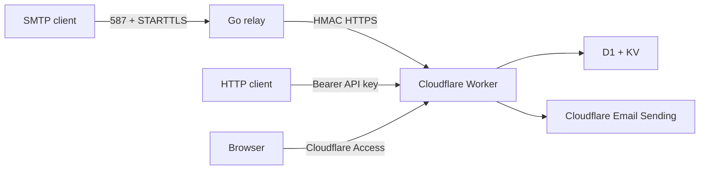

# Cloudflare Mail Relay

Authenticated SMTP and raw-MIME HTTP submission through Cloudflare Email
Sending. Use it with Gmail **Send mail as**, applications, or scripts.


[Explore the public demo](https://relay-demo.alexmiller.net). It uses the real
UI with local sample data. It cannot send mail or change Cloudflare resources.

## Why use this relay?

Cloudflare now provides [native authenticated SMTP](https://developers.cloudflare.com/email-service/api/send-emails/smtp/).
Use that when an account-wide API token and implicit TLS on port `465` meet
your needs.

This project adds:

- Per-user SMTP credentials and sender grants.
- STARTTLS submission on port `587`, including Gmail **Send mail as**.
- Quotas, idempotency, metadata-only events, and an admin/self-service UI.
- A raw-MIME HTTP API with scoped API keys.
- A safe conversation anchor for common client `Message-ID` values that
  Cloudflare replaces during delivery.

It is send-only. It does not receive mail, compose messages, run mailing lists,
schedule delivery, or persist message bodies itself.

## Architecture


```mermaid
flowchart LR
  SMTP["SMTP client"] -->|"587 + STARTTLS"| Relay["Go relay"]
  Relay -->|"HMAC HTTPS"| Worker["Cloudflare Worker"]
  HTTP["HTTP client"] -->|"Bearer API key"| Worker
  UI["Browser"] -->|"Cloudflare Access"| Worker
  Worker --> D1["D1 + KV"]
  Worker --> Email["Cloudflare Email Sending"]
```

The Worker also serves the static UI. Only `/admin/api/*` and `/self/api/*`
are behind Cloudflare Access. See [the architecture reference](docs/architecture.md)
for routes and trust boundaries.

## Requirements

- A Workers Paid account with [Email Sending](https://developers.cloudflare.com/email-service/get-started/send-emails/)
  enabled.
- Cloudflare Zero Trust enabled for the admin UI.
- Each sending domain on Cloudflare DNS and onboarded to Email Sending.
- A custom admin hostname on a Cloudflare-managed zone, such as
  `mail.example.com`. Platform hostnames require the explicit
  `--allow-platform-hostnames` setup flag.
- Node.js `>=22.23.2`, pnpm, and Docker.
- A Docker host reachable from SMTP clients on TCP `587`.

The relay host can be public or private. Gmail must be able to reach it;
internal applications do not require public ingress.

## Install

```sh
pnpm install
```

Create a [Cloudflare API token](https://developers.cloudflare.com/fundamentals/api/get-started/create-token/)
for setup and export it as `CLOUDFLARE_API_TOKEN`. Grant it:

- Account: Account Settings Read, Billing Read, D1 Edit, Email Sending Edit,
  Workers KV Storage Edit, Workers Scripts Edit, Workers Routes Read and Edit,
  Access Organizations Read, Access Apps Edit, and Access Policies Edit.
- User: User Details Read.
- Zone: Zone Read, DNS Edit, and Zone DNS Settings Edit for the admin and
  sending zones.

Verify the token:

```sh
pnpm --dir worker exec wrangler whoami
```

### Preflight

Preflight checks the account, zones, Email Sending, and existing resources. It
does not mutate Cloudflare. Without a token, it prints a plan only.

```sh
pnpm run setup \
  --account-id <cloudflare-account-id> \
  --admin-url https://mail.example.com \
  --allow-email admin@example.com \
  --domain example.com
```

Repeat `--allow-email` and `--domain` as needed. Use `pnpm run setup --help`
for all options. Use `pnpm run setup`, not `pnpm setup`; pnpm reserves the
shorter command.

### Apply

```sh
pnpm run setup --apply \
  --account-id <cloudflare-account-id> \
  --admin-url https://mail.example.com \
  --allow-email admin@example.com \
  --domain example.com \
  --smtp-host smtp.example.com
```

Across its resumable runs, apply creates or reuses D1, KV, and the Access app;
writes the Worker config; applies migrations; sets generated application
secrets; deploys the Worker; bootstraps the first admin; registers sending
domains; and writes the gitignored `RUNBOOK.md`.

The broad setup token is not used as the Worker's runtime token by default. On
a new install, setup intentionally stops before the final deploy until
`CF_API_TOKEN` exists. Create a second token with only **Account -> Email
Sending -> Edit** and **Zone -> Zone -> Read** for the sending zones, then set
it while the setup token remains exported for Wrangler authentication:

```sh
pnpm --dir worker exec wrangler secret put CF_API_TOKEN
```

Paste the runtime token at the prompt, then rerun the same `setup --apply`
command. `--push-cf-api-token` skips this separation and should only be used for
a one-shot install followed by immediate token replacement.

Setup writes generated secrets to
`.cf-mail-relay-setup-recovery.json` before the first remote mutation. The file
is gitignored, mode `0600`, and removed after `RUNBOOK.md` is written. Keep it
while recovering an interrupted install. Setup refuses to replace an incomplete
remote secret set without the matching journal. The destructive
`--rotate-all-worker-secrets` flag is for disaster recovery, not normal retries.

Validate the Access gate after deployment:

```sh
pnpm access:verify --admin-url https://mail.example.com
```

The Access app must protect only `/admin/api/*` and `/self/api/*`. The setup
wizard configures this boundary.

## DNS and relay host

Use the DNS records created by [Email Sending domain onboarding](https://developers.cloudflare.com/email-service/configuration/domains/).
Email Sending and Email Routing are separate; onboarding outbound sending does
not require moving inbound MX records.

Create a DNS-only `A` or `AAAA` record for the relay, for example:

```text
smtp.example.com. A <relay-host-ip>
```

Do not proxy this record through Cloudflare's HTTP proxy.

Install the pinned, nonroot Compose service by following
[infra/docker/README.md](infra/docker/README.md). It covers certificate setup,
health checks, upgrades, and rollback.

## SMTP clients

Create a sender grant and SMTP credential in the UI, then configure the client:

| Setting | Value |
|---|---|
| Host | Your relay hostname |
| Port | `587` |
| Security | STARTTLS |
| Username | Generated SMTP username |
| Password | Generated SMTP password |

For Gmail, follow Google's [Send mail as](https://support.google.com/mail/answer/22370)
flow and use those values. For a common, syntactically safe `Message-ID` whose
resulting `References` value fits Cloudflare's
[per-header limit](https://developers.cloudflare.com/email-service/reference/headers/),
the Worker adds the client's ID before delivery. This lets a reply reconnect to
Gmail's local Sent conversation after Cloudflare assigns a new ID.

## HTTP API

`POST /send` accepts raw MIME as base64 or base64url:

```sh
curl -fsS https://mail.example.com/send \
  -H "Authorization: Bearer <api-key>" \
  -H "Content-Type: application/json" \
  -H "Idempotency-Key: <stable-key>" \
  --data '{"from":"alex@example.com","recipients":["to@example.net"],"raw":"<base64url-mime>"}'
```

The API key user must be allowed to use `from`. The MIME `From:` header must
match it. The Worker strips `Bcc:` and rejects duplicate `From:`, `Sender:`, or
`Message-ID:` headers. See [examples/README.md](examples/README.md) for curl,
Node.js, and Python clients.

## Verify and operate

```sh
pnpm doctor:local -- --domain example.com --worker-url https://mail.example.com
pnpm doctor:delivery -- --domain example.com
```

`doctor:local` checks DNS, Worker health, SMTP STARTTLS, and optional SMTP AUTH.
`doctor:delivery` checks received DKIM and DMARC results.

See [docs/operations.md](docs/operations.md) for rotation, migrations,
idempotency, recovery, and dashboard actions. D1 is authoritative; KV is only a
cache. This project does not persist message bodies. Cloudflare's separate
[Email Preview](https://developers.cloudflare.com/email-service/configuration/domains/#email-preview)
is enabled automatically for new sending domains and retains sent content for
about seven days; disable it per domain if that is not desired.

## Develop

```sh
pnpm test
pnpm typecheck
pnpm build

cd relay
go vet ./...
go test ./...
```

See [CONTRIBUTING.md](CONTRIBUTING.md) before changing scope or security
boundaries.

## License

Apache-2.0. See [LICENSE](LICENSE).
