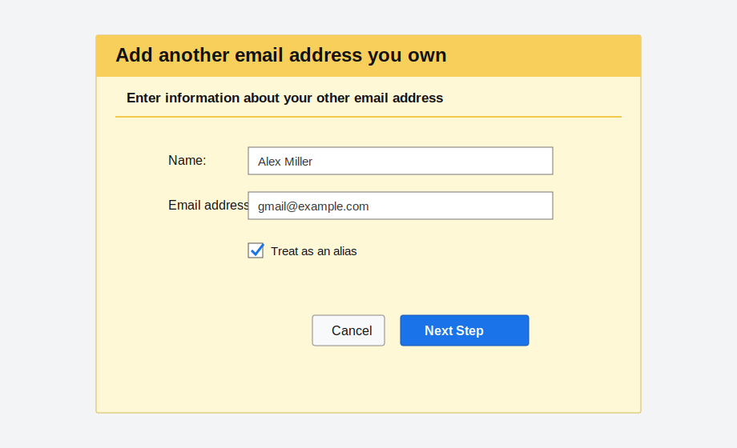
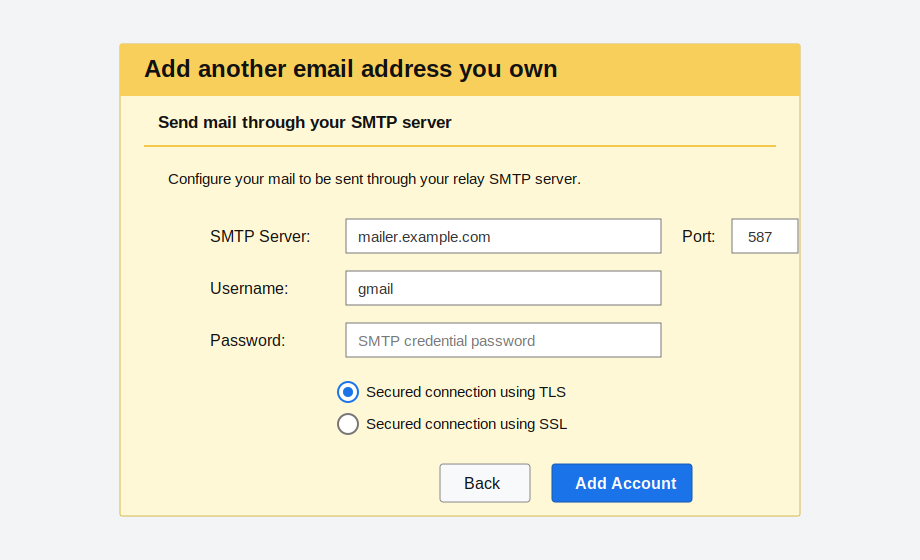
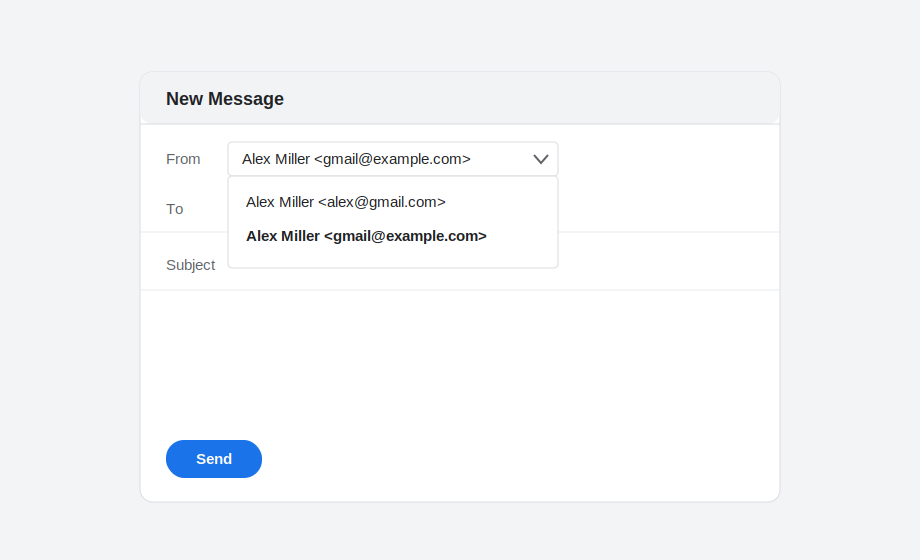

# Gmail "Send mail as" configuration

This is the Gmail-side setup for each custom address you want to send through
the relay, such as `gmail@example.com`.

## Before opening Gmail

Create the sending identity first:

1. In the admin UI, add or verify the sending domain.
2. Add the exact sender address under that domain.
3. Create an SMTP credential scoped to that address.
4. Copy the plaintext SMTP password. It is shown once.

The SMTP username can be any credential username you choose, such as `gmail`.
The relay validates the credential and then checks whether that credential may
send as the visible `From:` address.

## Add the address

In Gmail:

1. Open Settings -> See all settings -> Accounts and Import.
2. Under "Send mail as", choose "Add another email address".
3. Enter the display name and custom email address.
4. Leave "Treat as an alias" checked for normal alias behavior. Uncheck it only
   if you intentionally want Gmail to treat replies as a separate identity.

## Enter relay SMTP settings

Use your relay hostname, not a Cloudflare Worker URL:

| Field | Value |
|---|---|
| SMTP Server | `smtp.<primary-domain>` or `mailer.<primary-domain>` |
| Port | `587` |
| Username | SMTP credential username from the admin UI |
| Password | SMTP credential password shown once in the admin UI |
| Security | Secured connection using TLS |

Gmail sends a verification email after you submit this form. The message should
appear as a normal relay send event in the admin UI.

## Verify the address

Open the verification email and click Gmail's confirmation link. If the address
does not receive inbound mail, use a forwarding alias, temporary inbox, or
Cloudflare Email Routing long enough to receive the verification message.

After verification, compose a message in Gmail and choose the custom address in
the From selector.

## Multiple custom addresses across multiple domains

Repeat the same Gmail flow for each visible sender address.

All addresses can use the same relay hostname, even when the sender domains are
different. For example, both `gmail@alexmiller.net` and `me@example.org` can use
`mailer.alexmiller.net:587` as the SMTP server. Gmail only needs a valid
submission endpoint with STARTTLS and SMTP AUTH.

Per-credential scoping is configured in the admin UI under Credentials. A single
credential can be allowlisted for many sender addresses, or you can issue one
credential per address for tighter revocation boundaries.

## If verification or sending fails

Check these in order:

1. Admin UI -> Events: the Gmail verification attempt should have a `send_events`
   row.
2. Admin UI -> Auth failures: failed SMTP AUTH means Gmail has the wrong
   username or password.
3. Admin UI -> Domains: `sandbox` domains can only deliver to Cloudflare-verified
   recipient addresses.
4. Relay host: confirm inbound `587/tcp` is open and the certificate covers the
   relay hostname.
5. `pnpm doctor:local -- --domain <domain> --smtp-host <relay-host>
   --worker-url <worker-url>` for DNS, Worker health, and STARTTLS.
6. `pnpm doctor:delivery -- --domain <domain>` after a delivered test message to
   confirm DKIM and DMARC alignment.
